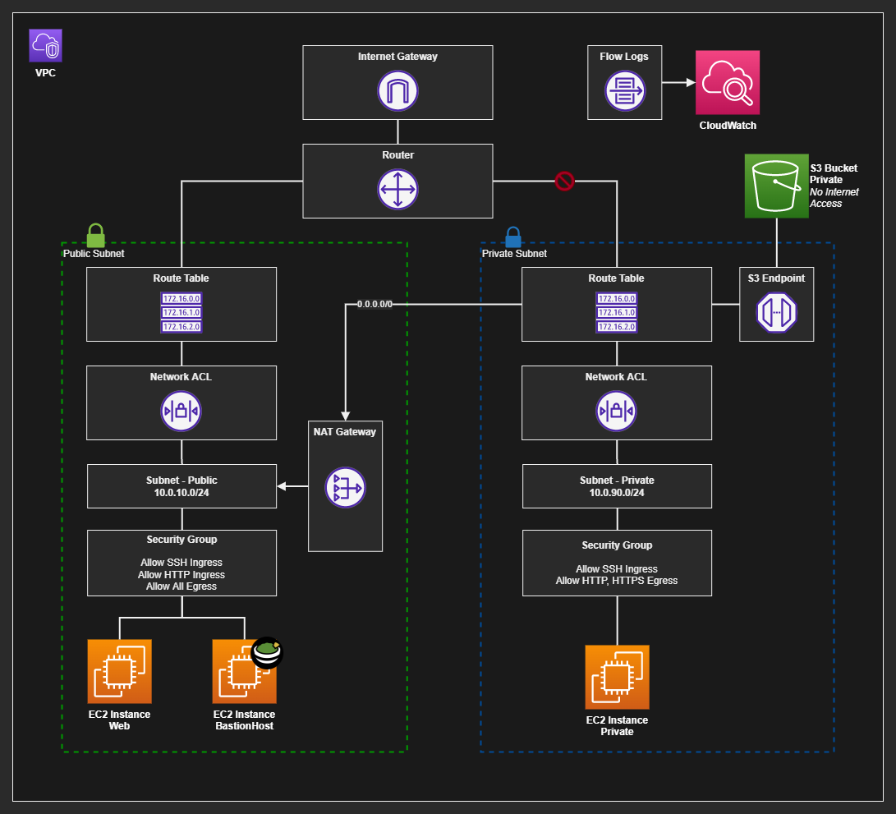

# AWS VPC

A public/private VPC architecture implemented with Terraform.



To create the infrastructure simply run:

```sh
terraform init
terraform apply -auto-approve
```

To test the VPC Endpoint functionality, remove the NAT Gateway. Don't forget to append the region so it connects to the correct endpoint.

```sh
aws s3 ls --region 'sa-east-1'
```

### Bastion Host

You'll need to create a bastion manually in the public subnet.

If you want to use [Guacamole](https://aws.amazon.com/marketplace/pp/prodview-hl2sry7k37mgq), the policies and role are created by my Terraform scripts, only requiring to deploy the instance.

To enter the instance use the default configuration:

- **User:** guacadmin
- **Password:** Instance ID

And to login into the private server, use the user and password from the `private.userdata.sh` file, which should be:

- **User:** ec2-user
- **Password:** kaiwinn
